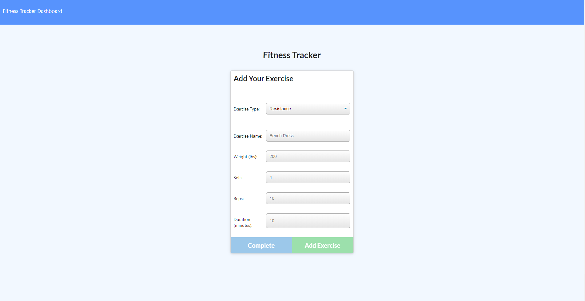
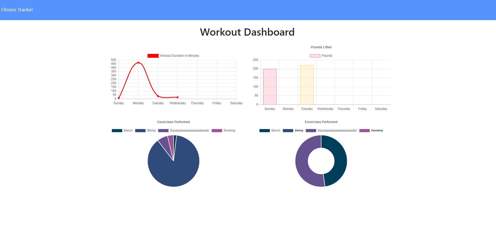

  
# fitness-tracker

## Table of Contents 
1. [Description](#description)

2. [Screenshots](#screenshots)

3. [Installation](#installation)

4. [Usage](#usage)

5. [Contributors](#contributors)

6. [Testing](#testing)

7. [Questions](#questions)

    
## Description 
This is a fitness application that creates exercises upon the users inputs. 
A user will be able to select either a resistance or a cardio workout and keep track of it.
There is a dashboard showing statistics of all workouts all together as well as displaying the last workout that has been done.

### URL(s)
[Repository](https://github.com/sornwill/fitness-tracker)
|
[Heroku Deployed Link](https://ws-fitness-tracker.herokuapp.com/?id=5f23857a1307b10017cc7668)
      
## Screenshots

    
## Installation
npm express, npm mongoose 
    
## Usage
General Use 
    
## License
MIT 
    
## Contributors
William Sorn 
    
## Testing
n/a 
      
## Questions
Questions? Please send contact me @sornwill or E-mail : sornwilliam@gmail.com
      
